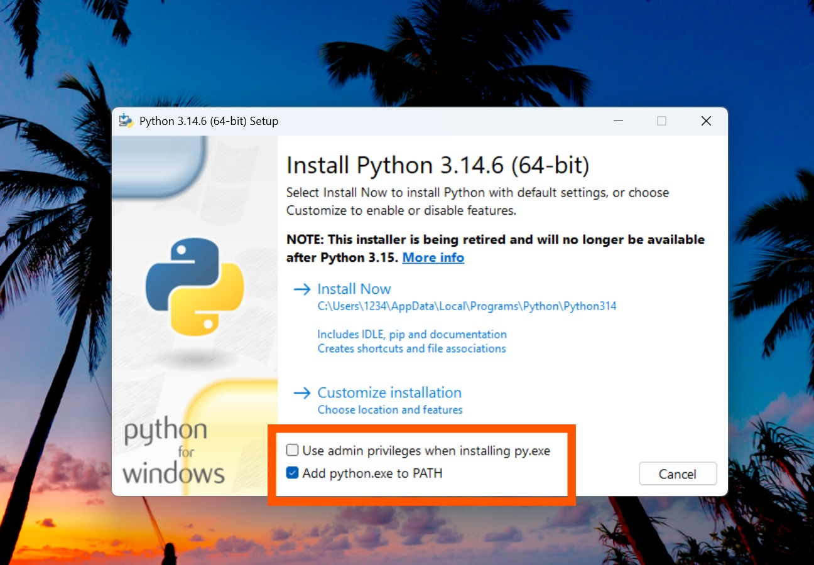
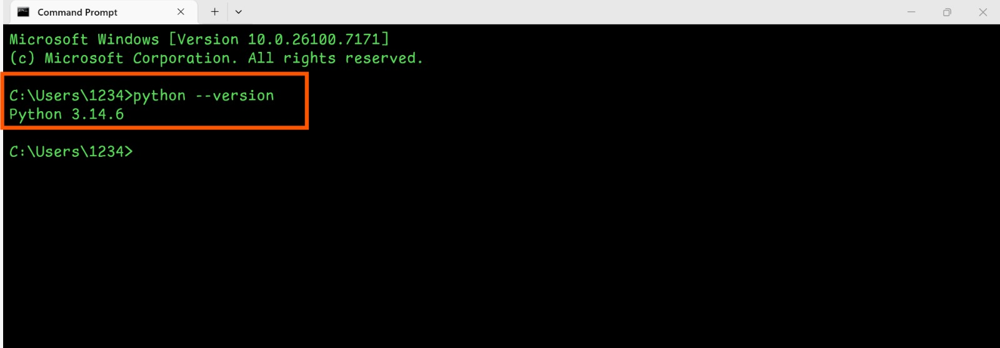
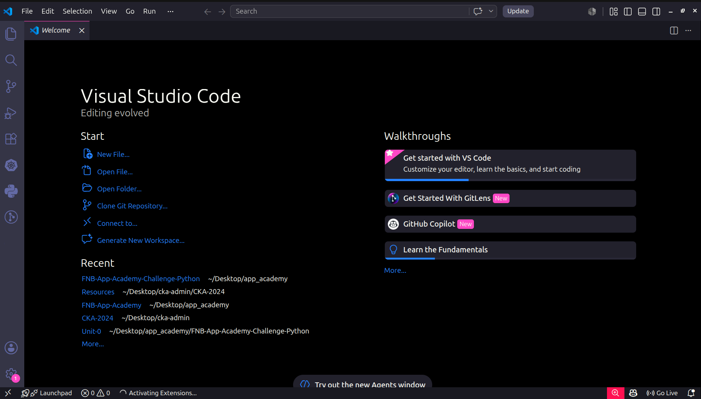
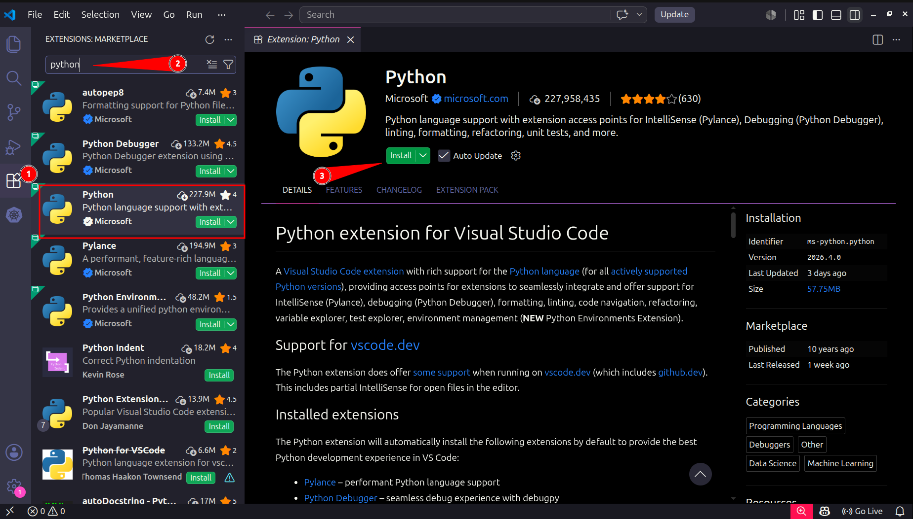
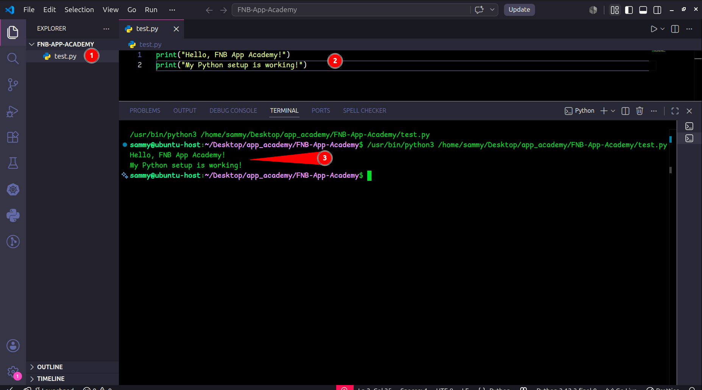

# Unit 0 – Setting Up the Python Development Environment

## 📖 Overview

Before writing any Python code, I needed to set up a development environment. In this unit, I installed Python, Visual Studio Code (VS Code), and the Python extension to create an environment where I can write, run, and debug Python programs.

This **README** documents the setup process I followed and can also serve as a reference for anyone setting up Python for the first time.

---

## 🎯 Learning Objectives

By the end of this unit, I was able to:

- ✅ Install Python
- ✅ Install Visual Studio Code
- ✅ Install the Python extension for VS Code
- ✅ Verify my Python installation
- ✅ Run my first Python program

---

## 🛠 Tools Used

| Tool | Purpose |
|------|---------|
| Python 3.x | Programming language |
| Visual Studio Code | Code editor |
| Python Extension (Microsoft) | Python support, IntelliSense and debugging |

---

## 🌐 Downloads

Download the required software before starting the installation.

| Software | Download |
|----------|----------|
| 🐍 Python 3.x | [Download Python](https://www.python.org/downloads/) |
| 💻 Visual Studio Code | [Download VS Code](https://code.visualstudio.com/) |
| 🧩 Python Extension | [Python Extension](https://marketplace.visualstudio.com/items?itemName=ms-python.python) |

---

## 📥 Step 1 – Install Python


1. Visit the official Python website 
2. Download the latest Python 3.x release.
3. Run the installer.
4. **Make sure you check "Add Python to PATH".**
5. Click **Install Now**.
   


### Verify the Installation

Open a terminal and run:

```bash
python --version
```

Expected output:

```text
Python 3.x.x
```




---

## 💻 Step 2 – Install Visual Studio Code

1. Download Visual Studio Code
2. Run the installer.
3. Install using the default settings.
4. Launch VS Code.




---

## 🧩 Step 3 – Install the Python Extension

1. Open VS Code.
2. Open **Extensions** (`Ctrl + Shift + X`).
3. Search for **Python**.
4. Install the official extension by **Microsoft**.




---

## ▶️ Step 4 – Test the Installation

Create a file called:

```text
test.py
```

Add the following code:

```python
print("Hello, FNB App Academy!")
print("My Python setup is working!")
```

Run the file.

Expected output:

```text
Hello, FNB App Academy!
My Python setup is working!
```





---

## ✅ Setup Checklist

- [x] Python installed
- [x] VS Code installed
- [x] Python extension installed
- [x] Python installation verified
- [x] First Python program executed successfully

---

## 💡 Key Takeaways

- Python is the programming language used throughout this course.
- VS Code provides an efficient environment for writing Python code.
- The Python extension adds syntax highlighting, IntelliSense, debugging, and code execution support.
- Verifying the installation ensures the development environment is ready before moving on.

---

## 📚 Resources

- Python Official Website
- Visual Studio Code
- Python Extension for VS Code

---

## ⏭️ Next Unit

➡️ **Unit 1 – Introduction to Python**